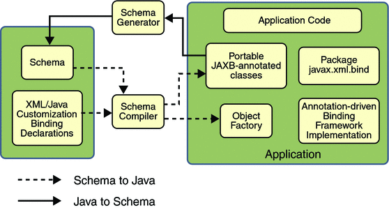

# Introduction to JAXB #
1. JAXB: Java Architecture for XML Binding.
	1. It is a fast way to combine XML Schemas and Java representations
2. Used for incorporating XML data processing in Java applications.
3. Methods in JAXB:
	1. Unmarshalling (reading) XML documents into Java content trees
	2. Marshalling (writing) Java content trees back into XML docs
	3. Way to generate XML schema from Java objects
4. Support:
	1. All W3C XML Schema features
	2. Binding Java-to-XML with addition of `javax.xml.bind.annotation` to control binding
	3. Reduction in number of generated schema-derived classes.
	4. Validation capabilities through JAXP validation APIs
	5. Smaller runtime libraries 

## JAXB Architecture ##
1. Components and interactions in JAXB processing model.

### Architectural Overview ###
1. JAXB Architectural Overview:

	

	1. Components:
		1. Schema compiler: Binds source schema to set of schema-derived program elements. 
			1. XML-based binding language describes the binding
		2. Schema generator: Maps set of program elements to a derived schema.
			1. Program annotations describe the mapping
		3. Binding runtime framework: Provides unmarshalling (reading) and marshalling (writing) operations for 
			1. accessing XML content
			2. manipulating XML content
			3. validating XML content

### The JAXB Binding Process ###
1. Steps in JAXB Binding Process:

	

2. Steps for JAXB data binding:
	1. Generate classes: XML schema is input to JAXB binding compiler to generate JAXB classes based on the schema.
	2. Compile classes: All generated classes, source files and app code must be compiled.
	3. Unmarshal: XML documents which are written according to constraints in source schema are unmarshalled by JAXB binding framework.
		1. JAXB supports unmarshalling XML data from sources other than files and documents like:
			1. DOM nodes
			2. String buffers
			3. SAX sources
			4. ...
	4. Generate content tree: Unmarshalling generates content tree of data objects instantiated from generated JAXB classes.
		1. Content tree: represents structure and content of source XML documents.
	5. Validate (optional): Unmarshalling involves validation of source XML documents before generating content tree.
		1. If changes are made to content tree, JAXB validation can be applied before marshalling content back to XML document.
	6. Process content: Client app can modify XML data represented by content tree through interfaces generated by binding compiler.
	7. Marshal: Processed content tree is marshalled to one or more XML output docs.
		1. Content can be validated before marshalling.

### More About Unmarshalling ###
1. Unmarshalling: gives client app the ability to convert XML data into JAXB-derived Java objects.

### More About Marshalling ###
1. Marshalling: gives the ability to convert JAXB-derived Java object tree into XML data.
	1. Marshaller uses UTF-8 encoding by default when generating XML data.
2. Client need not validate content tree before marshalling.
3. Content tree is not required to be valid wrt original schema in order to marshal XML data

### More About Validation ###
1. Validation: Process of verifying that XML document meets all constraints expressed in schema.
	1. JAXB 1.0: provides validation at unmarshal time
		1. On-demand validation on content tree.
	2. JAXB 2.0: allows validation at unmarshal and marshal time (web service processing model - be lax in reading data and strict on writing data)

## Representing XML Content ##
1. How does JAXB represent XML content as Java objects?

### Java Representation of XML Schema ###
1. JAXB supports grouping of generated classes in Java packages.
	1. Package contents:
		1. Java class name is derived from XML element name (or specified by binding customization)
		2. `ObjectFactory` class: Factory used to return instances of bound Java class.

## Binding XML Schemas ##

## Customizing Generated Classes and java Program Elements ##
## Basic Examples ##
## Customizing JAXB Bindings ##
## Java-to-Schema Examples ##
## For More Information ##